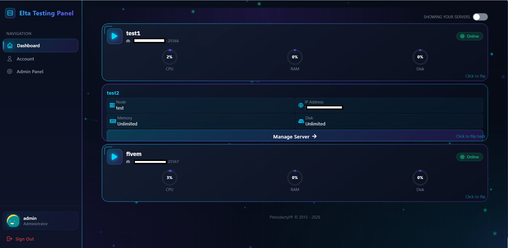

# 🎮 Pterodactyl Addons Panel

A fully customized Pterodactyl Panel with game-specific addons, admin tools, and premium themes - **completely FREE!**

> **Made with ❤️ by [elta.one](https://elta.one) (EltaGamingHost) and given away for FREE!**

  

## ✨ Features

### 🎮 Game Addons
| Game | Features |
|------|----------|
| **Minecraft** | Modrinth Mods, Hangar/Spiget Plugins, Version Switcher, Modpacks |
| **Rust** | uMod Plugin Browser (1700+ plugins), RCON Console, Map Manager, Wipe Scheduler, Player Management |
| **CS2** | Plugin Manager, RCON Console, Map Manager, Workshop Support, Match Config |
| **FiveM** | Resource Manager (35+ scripts), Config Editor, Auto Updater, Player Management |
| **ARK** | Steam Workshop Mods (30+), Config Editor (35+ settings), Cluster Manager |
| **GMod** | Addon Manager, RCON Console, Config Editor, Player Management |
| **Valheim** | Thunderstore Mods (30+), World Manager, Config Editor |
| **7 Days to Die** | Mod Installer (14+ mods), Config Editor (30+ settings) |

### 🛠️ Admin Addons
- **Subdomain Manager** - Custom domains with Cloudflare DNS sync
- **Billing System** - Stripe integration, subscriptions, invoices
- **Resource Upgrades** - RAM/CPU/Disk upgrade packages
- **Abuse Protection** - Server monitoring & protection
- **Audit Logger** - Track all admin actions
- **Announcements** - System-wide notifications
- **Maintenance Mode** - Scheduled maintenance
- **Crash Monitor** - Server crash detection
- **Task Scheduler** - Automated tasks

### 🎨 Themes
- **Neon Gaming** - Dark theme with cyan/purple neon effects
- **Eltahost Premium** - Professional theme with custom dashboard

## 🚀 Quick Install

### Requirements
- Fresh Ubuntu 20.04/22.04/24.04 or Debian 11/12
- Minimum 2GB RAM, 10GB disk
- Root access
- Domain name pointed to your server

### One-Command Installation

```bash
bash <(curl -s https://raw.githubusercontent.com/MuLTiAcidi/pterodactyl-addons/main/install.sh)
```

The script will:
1. ✅ Install all dependencies (PHP, MySQL, Nginx, Redis, Node.js)
2. ✅ Download and install the complete panel
3. ✅ Configure database and create tables
4. ✅ Build frontend assets
5. ✅ Set up Nginx with SSL (Let's Encrypt)
6. ✅ Create your admin account

**Installation takes approximately 10-15 minutes.**

## 📸 Screenshots

### Dashboard


### Game Addons


### Admin Panel


## 🔧 Manual Installation

If you prefer manual installation:

```bash
# 1. Download the panel
cd /var/www
curl -Lo pterodactyl.tar.gz https://github.com/MuLTiAcidi/pterodactyl-addons/releases/latest/download/pterodactyl-addons-panel.tar.gz
mkdir pterodactyl && tar -xzf pterodactyl.tar.gz -C pterodactyl
cd pterodactyl

# 2. Install dependencies
composer install --no-dev --optimize-autoloader
yarn install && yarn build:production

# 3. Configure (follow Pterodactyl docs for database setup)
cp .env.example .env
php artisan key:generate
php artisan migrate --seed

# 4. Set permissions
chown -R www-data:www-data /var/www/pterodactyl/*
```

## 🐦 Wings Installation

After installing the panel, you need Wings on your game server nodes:

```bash
bash <(curl -s https://raw.githubusercontent.com/MuLTiAcidi/pterodactyl-addons/main/wings-install.sh)
```

Or use the official Pterodactyl Wings installer.

## 📝 Configuration

### Cloudflare (for Subdomain Manager)
Add to your `.env`:
```env
CLOUDFLARE_API_KEY=your-api-key
CLOUDFLARE_ZONE_ID=your-zone-id
CLOUDFLARE_EMAIL=your-email
```

### Stripe (for Billing)
Add to your `.env`:
```env
STRIPE_KEY=pk_live_xxx
STRIPE_SECRET=sk_live_xxx
STRIPE_WEBHOOK_SECRET=whsec_xxx
```

## 🆘 Support

- **Issues:** [GitHub Issues](https://github.com/MuLTiAcidi/pterodactyl-addons/issues)
- **Discussions:** [GitHub Discussions](https://github.com/MuLTiAcidi/pterodactyl-addons/discussions)

## 📜 License

This project is open source and available under the [MIT License](LICENSE).

## 🙏 Credits

- [Pterodactyl](https://pterodactyl.io/) - Original panel
- [Pterodactyl Installer](https://github.com/pterodactyl-installer/pterodactyl-installer) - Installation script inspiration
- All the amazing open source contributors!

---

---

**Made with ❤️ by [elta.one](https://elta.one) (EltaGamingHost) and given away for FREE!**

⭐ If you like this project, please give it a star!
